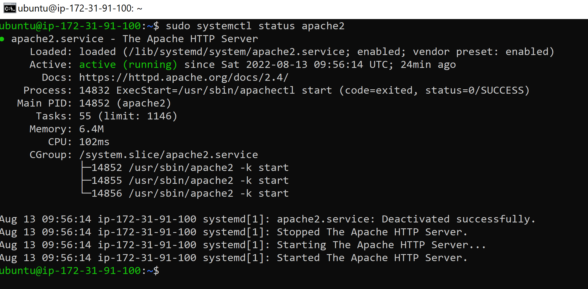
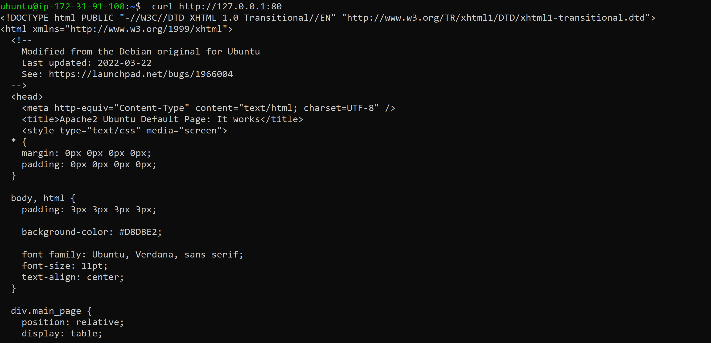
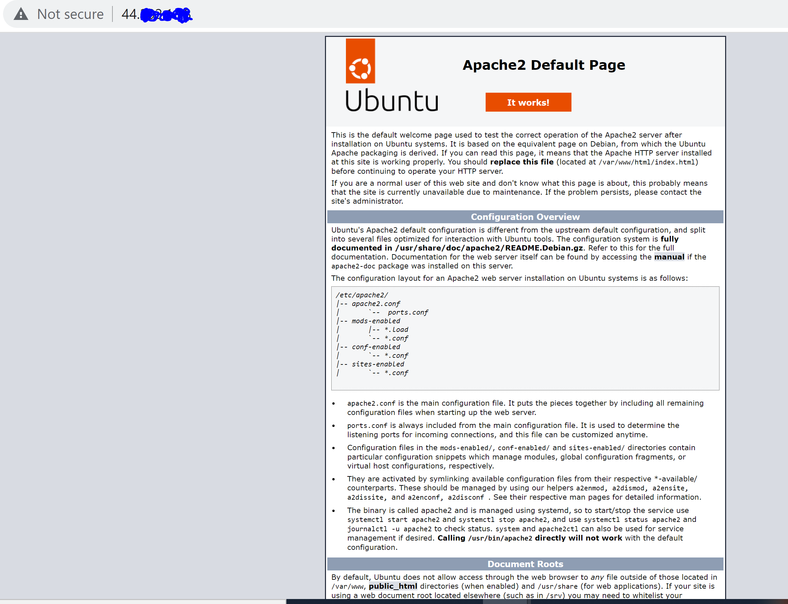
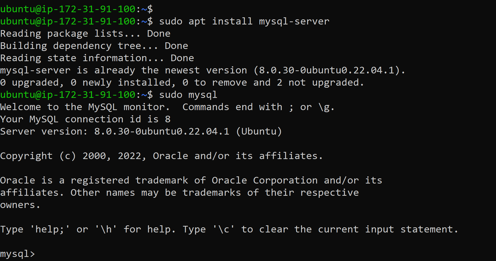

# PROJECT-1 DOCUMENTATION

##  Step-1 : Installing APACHE and updating the Firewall

1. Update the Ubuntu package manager
- sudo apt update

2. Install Apache server
- sudo apt install apache2

3. Verify the installed apache2 server
- sudo systemctl status apache2

  

4. Accessing the Apache2 server on the Ubuntu shell 
-  curl http://localhost:80 or  curl http://127.0.0.1:80

   
   

5. Accessing the Apache2 server via brower on port 80

- First retrieve the Public IP address of the Ubuntu install on the EC2 instance.

  curl -s http://169.254.169.254/latest/meta-data/public-ipv4

 - Web browser access to the Apache2 server

   

## Step-2 : INSTALLING MYSQL

1. Install mysql server
 - sudo apt install mysql-server and log into the MySql

   
 - Setting the root password for access the mysql database

   

- Password Access to the Mysql Database

  

