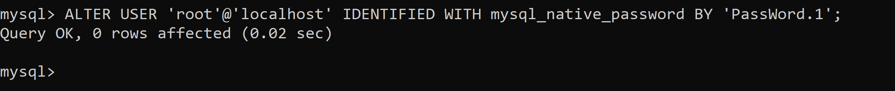
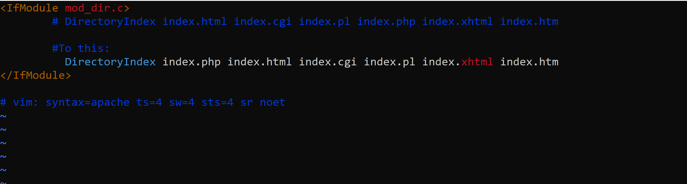

# PROJECT-1 DOCUMENTATION

##  Step-1 : Installing APACHE and updating the Firewall

1. Update the Ubuntu package manager
- sudo apt update

2. Install Apache server
- sudo apt install apache2

3. Verify the installed apache2 server
- sudo systemctl status apache2

  

4. Accessing the Apache2 server on the Ubuntu shell 
-  curl http://localhost:80 or  curl http://127.0.0.1:80

  
   

5. Accessing the Apache2 server via brower on port 80

- First retrieve the Public IP address of the Ubuntu install on the EC2 instance.

  *curl -s http://169.254.169.254/latest/meta-data/public-ipv4*

 - Web browser access to the Apache2 server

   

## Step-2 : INSTALLING MYSQL

1. Install mysql server
 - *sudo apt install mysql-server and log into the MySql*

   
 - Setting the root password for access the mysql database

   

- Password Access to the Mysql Database

  

## Step-3 : INSTALLING PHP

1. Install the three packages php, php-mysql (for communication between PHP and Mysql database)  and libapache2-mod-php (for Apche server to handle PHP files)

- *sudo apt install php libapache2-mod-php php-mysql*
- check the PHP version

*php -v*

## Step-4 : CREATING A VIRTUAL HOST FOR YOUR WEBSITE USING APACHE

1. Create a domain directory and change the ownership.

2. Creatig a new configuration file inside the Apache's sites-available directory
 - *sudo vi /etc/apache2/sites-available/projectlamp.conf*

 

 - Confirm the the created conf. file
   *sudo ls /etc/apache2/sites-available*

   

-  Enable the new virtual host with the command 
   *sudo a2ensite projectlamp*
- Disable the default website, and confirm the configuration of the have no synthax error.

   

- Create a new website using
*sudo echo 'Hello LAMP from hostname' $(curl -s http://169.254.169.254/latest/meta-data/public-hostname) 'with public IP' $(curl -s http://169.254.169.254/latest/meta-data/public-ipv4) > /var/www/html/project_lamp/index.html*

- Display the new website from the web browser using 

    http://44.202.1.98
    
    

 ## Step-5 :  ENABLE PHP ON THE WEBSITE

 1. In order for index.php to be the landing page for the website, the dir.conf needs to be edited.

    *sudo vim /etc/apache2/mods-enabled/dir.conf*

    - Edit the file as shown below

    

    - Then reload the Apache2 server with the command

      *sudo systemctl reload apache2*

    - Create a new file name index.php

      *vim /var/www/html/projectlamp/index.php*

    - Add the following text into the new blank index.php file.
     
          <?php
      phpinfo();

     

2.  Launch the new PHP website from the web browser

       

    

       
   

